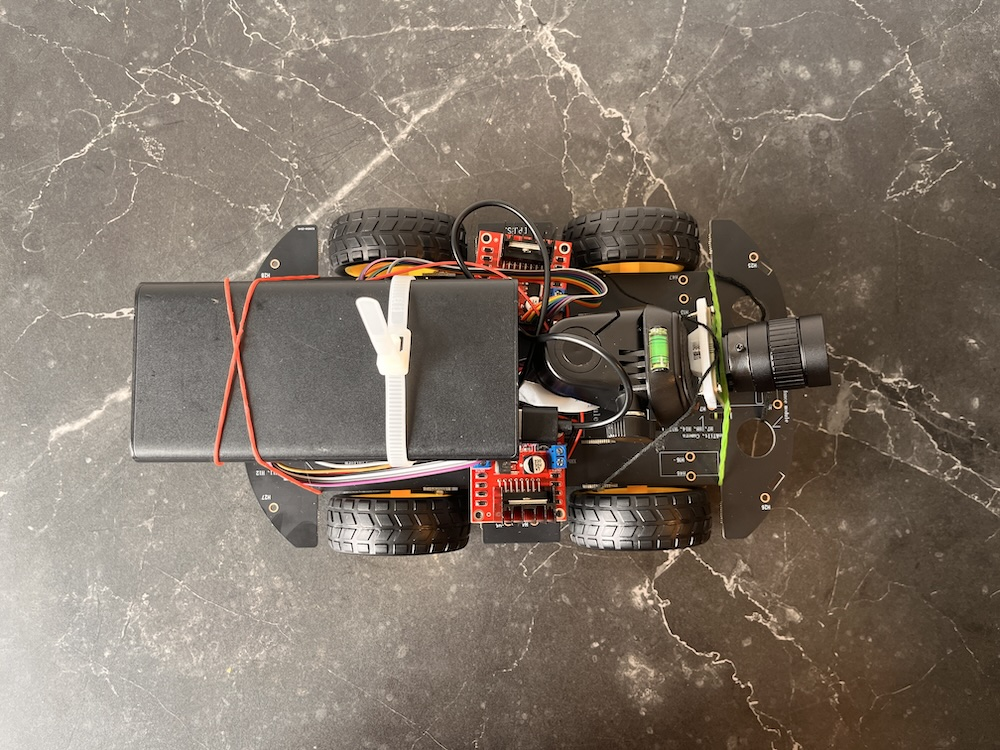

# R1

R1 is a Raspberry Pi 5-based Physical AI robot platform for experiments in robot perception, reasoning, and control. It uses ROS 2 to organize the system into modular software components.

<p align="center">
  
</p>

#### Goals

R1 is designed as a small, always-on research platform for testing embodied AI systems on real hardware. The platform focuses on:

- Perception: multi-camera sensing, object/face detection, and scene understanding
- Reasoning/AI: language-driven interpretation of visual events and robot state
- Control: modular action execution through ROS 2 nodes
- Observability: live monitoring through Foxglove, Prometheus, and Grafana
- Remote compute: offloading heavier AI workloads to a compute server when needed

The theory is mentioned here: projectnode1.github.io which is a comprehensive resource for understanding the underlying concepts.
This repository doesn't focus on writing out the concepts but more about implementing and running the R1 platform.

### Setup Instructions:
```
mkdir -p /home/murphy/Documents/r1/src
cd /home/murphy/Documents/r1/src

ros2 pkg create r1_nodes \
  --build-type ament_python \
  --dependencies rclpy sensor_msgs std_msgs cv_bridge

cd /home/ubuntu/murphy_p2/src
cd /home/ubuntu/murphy_p2/src/r1_nodes/r1

sudo chown -R murphy:murphy /home/murphy/Documents/murphy_p2 # fix ownership of the files in the host machine

rm -rf build install log

colcon build
source install/setup.bash

docker run -it --rm \
  --name r1_ros \
  --user $(id -u):$(id -g) \
  --add-host=host.docker.internal:host-gateway \
  --group-add video \
  --device /dev/video0 \
  --device /dev/video1 \
  --device /dev/video2 \
  --device /dev/video3 \
  -p 8765:8765 \
  -v /home/murphy/Documents/r1:/home/ubuntu/r1 \
  ros:jazzy-perception

docker run -it --rm \
  --name r1_ros \
  --add-host=host.docker.internal:host-gateway \
  --group-add video \
  --device /dev/video8 \
  --device /dev/video9 \
  -p 8765:8765 \
  -v /home/murphy/Documents/r1:/home/ubuntu/r1 \
  r1_ros:current

docker commit r1_ros r1_ros:current

cd ~/r1
source /opt/ros/jazzy/setup.bash
source install/setup.bash
ros2 launch r1 bringup.launch.py \
  event_min_interval_sec:=5.0 \
  event_max_silence_sec:=5.0 \
  camera_uids:="[8]" \
  camera_labels:='["left", "right"]' \
  yolo_camera_uid:=8 \
  enable_slam:=false \
  enable_ear:=false \
  enable_audio:=false \
  enable_vlm:=false \
  enable_2dobd:=true \
  enable_3dobd:=false
  

docker exec -u 0 -it murphy_ros bash
apt update
apt install -y ros-jazzy-foxglove-bridge
exit

docker exec -it murphy_ros bash

ros2 topic hz /camera/uid_0/image_raw
ros2 topic hz /camera/uid_2/image_raw

cd ~/r1
source /opt/ros/jazzy/setup.bash
source install/setup.bash
ros2 launch foxglove_bridge foxglove_bridge_launch.xml

ws://192.168.68.59:8765

docker exec -it murphy_ros bash
cd ~/murphy_p2
source install/setup.bash
python3 -m pip install --upgrade pip
python3 -m pip install ultralytics opencv-python-headless


docker exec -u 0 -it murphy_ros bash
sudo apt update
sudo apt install -y python3-pip
apt update
apt install -y python3-pip python3-opencv
cd /home/ubuntu/murphy_p2
source install/setup.bash

python3 -m pip install --break-system-packages ultralytics --no-deps
python3 -m pip install --break-system-packages --no-cache-dir matplotlib \
  torch torchvision \
  --index-url https://download.pytorch.org/whl/cpu
python3 -m pip install --break-system-packages matplotlib requests onnxruntime
python3 - <<'PY'
from ultralytics import YOLO

model = YOLO("/home/ubuntu/murphy_p2/yolov12n-face.onnx")
results = model.predict(
    "/home/ubuntu/murphy_p2/latest_frame.jpg",
    imgsz=320,
    device="cpu",
    verbose=True,
)

for r in results:
    print(r.boxes)
PY

```

### Nodes:

##### Cameras Node:
```
cd ~/murphy_p2
source ~/murphy_p2/install/setup.bash
ros2 run murphy_p2 cameras_node --ros-args \
  -p camera_uids:="[0, 2]" \
  -p camera_labels:="[left, right]"
```

##### Visual Processor Node:
```
cd ~/murphy_p2
source ~/murphy_p2/install/setup.bash
ros2 run murphy_p2 visual_processor_node
```

##### Brain Node:
```
docker exec -it murphy_ros bash
cd ~/murphy_p2
source ~/murphy_p2/install/setup.bash
ros2 run murphy_p2 brain_node
```

##### Audio Node and its bluetooth bridge:
```
docker exec -it murphy_ros bash
cd ~/murphy_p2
source ~/murphy_p2/install/setup.bash
ros2 run murphy_p2 audio_node

# audio control
pactl list short sinks
pactl set-sink-volume bluez_output.41_42_12_84_8B_60.1 40%

# audio bridge controlling the bluetooth speaker from the host machine
chmod +x /home/murphy/Documents/murphy_p2/src/speaker_bridge.sh
apt update
apt install -y espeak alsa-utils
sudo apt install -y sox

docker exec -it murphy_ros bash
cd ~/murphy_p2
source ~/murphy_p2/install/setup.bash
ros2 topic pub --once /audio/heard_text std_msgs/msg/String "{data: 'how many cans are there and are of which brand? what about bottles?'}"

# run the speaker bridge in the host machine to forward audio from ROS to the bluetooth speaker
/home/murphy/Documents/murphy_p2/src/speaker_bridge.sh
```

##### Ear Node:

```
docker exec -it murphy_ros bash
cd ~/murphy_p2
source ~/murphy_p2/install/setup.bash
ros2 run murphy_p2 ear_node
```

##### Action Node:

```
docker exec -it murphy_ros bash
cd ~/murphy_p2
source ~/murphy_p2/install/setup.bash
ros2 run murphy_p2 action_node
```

##### VLM Node:

```
ollama run moondream # on the host

```
#### R1 Compute Server

There is need for a remote server that handle computational loads for R1 that are bigger than what the R1 can handle locally.

#### R1 System Monitor

We setup Grafana and Prometheus to monitor the system. It allows us to visualize the system's performance and identify potential issues. 

What questions can it answer?

### References:
- ROS 2 documentation: https://docs.ros.org/
- https://github.com/apple/ml-cubifyanything
- https://arxiv.org/abs/2005.14165
- https://arxiv.org/abs/2203.02155
- https://arxiv.org/pdf/2412.16720
- https://github.com/karpathy/autoresearch
- https://github.com/facebookresearch/dinov3
